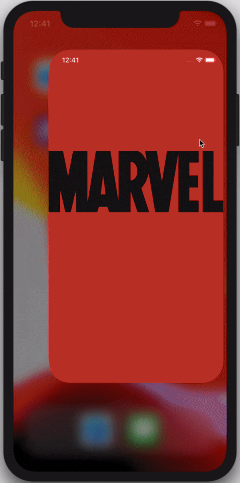
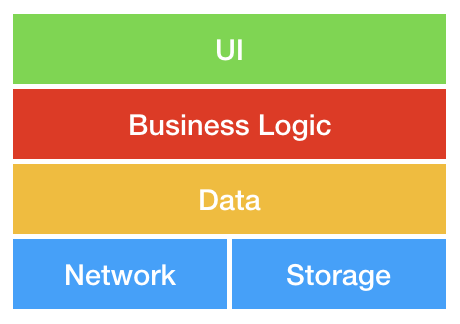
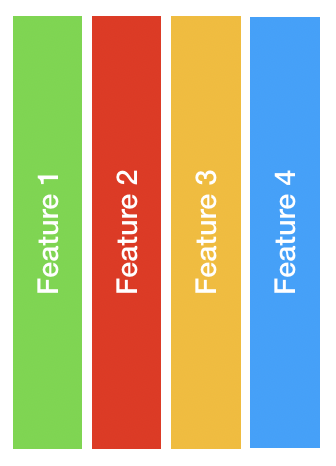
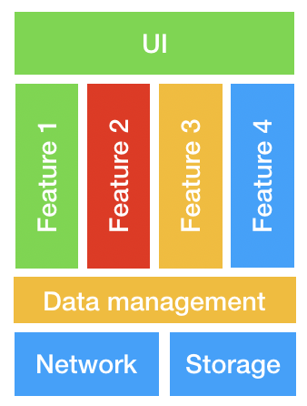
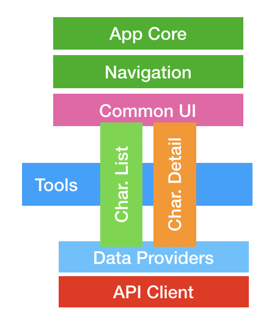
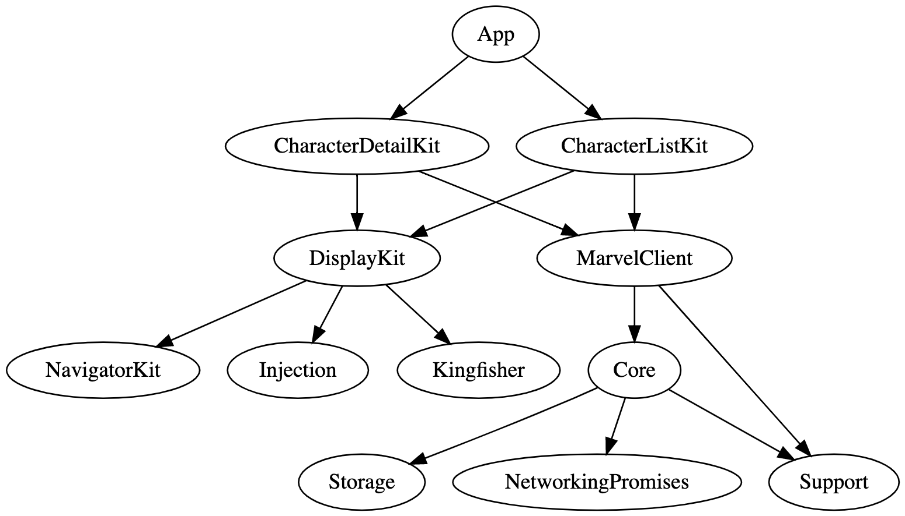

# Excelsior
### Just playing with Marvel Open API in a demo project.

The idea behind this project is to develop an iOS app with an modern scalable architecture, putting into practice several design patterns and techniques.

## 💬 Description 

Refactor performed by [@JulianAlonso](https://github.com/julianalonso), you can follow all refactor steps [here](http://diariodeprogramacion.com/2020/04/15/ios-at-scale-step0-introduction.html)

From original project [excelsior](https://github.com/rafaelbartolome/excelsior)

### Disclaimer

Talking about architectures is quite hard as everybody has a preferred one, normally the one that works better for solving a specific problem.
 
Please, be open minded with this repo. The idea is to develop several patterns that have solved problems in projects I worked on over the last years.

The main objective is not to develop a **perfect** architecture (that's not a real thing) but to try to solve a common problem, make a scalable architecture, divided in several independent frameworks in order to allow the collaboration of a **big** number of developers in a **huge** project with as few conflicts as possible.

### Vertical vs horizontal frameworks

• **Horizontal frameworks** are great for base layers to be used by several teams. Problem is that it's easy to generate conflicts as everybody needs to touch common code all time to develop a new feature.

• **Vertical frameworks** are great to avoid conflict between several teams, as one team only needs to modify (or create) a framework for a functionality. Problem is that part of the code will be repeated (ex: the part that controls network events) or disseminated in several parts.

• **Mixed approach** Why not having the best from both worlds? Well, that's complicated. Creating a mixed approach with horizontal frameworks for common code parts and vertical features has a lot of challenges but it looks as the best approach for big applications.
Main challenge is to define the boundaries of each framework and define who is responsible of maintain the common parts
. But using tools like Tuist and SPM to handle this, this tasks could be performed without effort.

## 🏗 Frameworks architecture

Finally, for this demo I decided to implement a mixed approach, with some horizontal frameworks that provides common functionality and vertical frameworks for each main feature:

After refactor:
- (REMOVED) **AppCoreKit** (was unuseful) that manages the app lifecycle and initializes all other frameworks.
- **NavigationKit** that allows us to navigate between features.
- (RENAMED) **DisplayKit**  with all common views, fonts, styles and assets.
- (RENAMED) **Support** that contains common code, utils, etc.
- (RENAMED) **MarvelClient** that implements the repository pattern to hide network or storage complexity to upper layers
- (TRANSFORMED TO LIBRARY) **Networking** Networking library
- (ADDED) **Promises** Promises spm package under development
- (ADDED) **Core** Main domain module
- (ADDED) **Storage** A simple package to hide how we storage data. Implemented cache.

### 🏠Features internal architecture

For the internal construction of each feature I opted for the Model-View-Presenter approach, with an interactor that provides the data through a repository.
 
Is an extension from VIPER architecture, but having the *entities* in *repositories* and using a *Navigator* instead of a *Router*.
For the building of all parts of the app, *Assemblies* are used, that allow dependency inversion through layers due to the injection of dependencies. This approach facilitates testing as all dependencies are injected during the construction of the objects.
Also most boundaries between layers are defined by protocols to avoid coupling the code. This abstraction also allows to create test doubles for the unit tests.

Feature detail kit are based on Single Data Flow, with reactive view and decoupled ViewModel. The view model handles actions, and update the view based on states.

## 📌 Features 

- [x] List of Marvel characters.
- [x] Detail of a specific character.
- [x] Some Unit test
- [x] Just a few UI test
- [x] Powered by tuist
- [x] SPM Packages to share code
- [x] Swiftier code

## 😬 Todo 

- [ ] Add tests to the other feature.
- [ ] Improve the way the list behaves when new data arrives.
- [ ] Implement a multicast delegate in the repo to inform upper layers for data changes.
- [ ] Implement an storage to avoid unnecessary network calls to ask for characters already loaded.
- [ ] Implement an API client with stub responses in order to improve UI tests.
- [ ] Localization
- [ ] Integrate project with a CI service tool to automate all the things.

## ⚙️ Requirements

- Xcode >= 11.3

## 🔍 References

- **[Clean Architecture](https://blog.cleancoder.com/uncle-bob/2012/08/13/the-clean-architecture.html)** - "The clean cloder blog" [Robert C. Martin (Uncle Bob)](https://twitter.com/unclebobmartin)

- **[Viper](https://www.objc.io/issues/13-architecture/viper/)** - "Architecting iOS Apps with VIPER" By [Jeff Gilbert](jeff.gilbert@mutualmobile.com) and [Conrad Stoll](https://twitter.com/conradstoll)

- **[Repository Pattern](https://martinfowler.com/eaaCatalog/repository.html)** - "Catalog of Patterns of Enterprise Application Architecture" by Edward Hieatt and Rob Mee

- **[Navigation](https://jobandtalent.engineering/the-navigator-420b24fc57da)** - "Another twist to iOS navigations" [Ruben Mendez](https://jobandtalent.engineering/@ruben.mendez)

- **[Dependency Injection](https://www.vadimbulavin.com/dependency-injection-in-swift/)** - "Advanced Dependency Injection on iOS with Swift 5" by [Vadim Bulavin](https://www.vadimbulavin.com)

## 📚 Dependencies

- **[INJECTION](https://github.com/julianalonso/Injection)**
- **[Kingfisher](https://github.com/onevcat/Kingfisher)**

## 🍔 Author

- Rafael Bartolomé – [@rafaelbartolome](https://twitter.com/rafaelbartolome) – rafa@rafaelbartolome.es
- Julian Alonso - [@JulianAlonso](https://twitter.com/maisterjuli) - julian.alonso.dev@gmail.com

Most of the ideas from this repo comes from the [blog post series](http://diariodeprogramacion.com/2020/04/15/ios-at-scale-step0-introduction.html)

## 📄 License

Excelsior is available under the MIT license. See ``LICENSE`` file for more information.